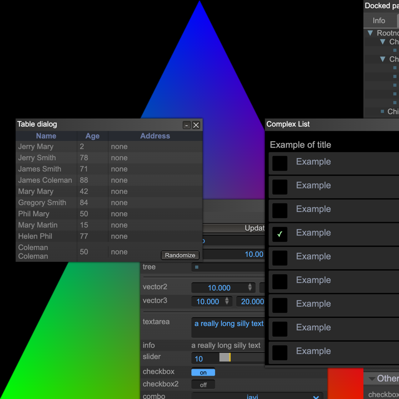
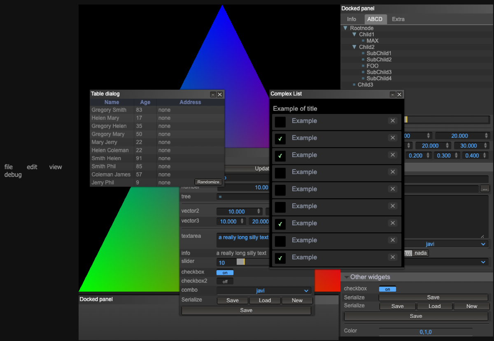

# gloden-ratio — raw WebGPU triangle with a LiteGUI shell

A from-scratch WebGPU renderer — no engine, no wrapper — drawing an indexed,
vertex-coloured triangle, with a [LiteGUI](https://github.com/jagenjo/litegui.js)
editor shell layered over the canvas.

The value here is that every WebGPU step is explicit and in one file
([`src/renderer.ts`](src/renderer.ts)): adapter and device request, buffers
created `mappedAtCreation` and 4-byte aligned, vertex buffer layouts, an
explicit pipeline layout, a depth-stencil attachment, and per-frame command
encoding.



Running the page, that canvas sits behind LiteGUI's panels:



Those widgets — the table of names, the "Complex List", the docked panels — are
**LiteGUI's own demo layout**, carried over verbatim in `src/ui/gui.ts`. They
are not a UI for this renderer, and they cover most of the triangle. Replacing
that with real controls is the obvious next step; `gui/code.js` is an earlier
loose copy of the same demo and is not referenced by the build.

## Requirements

A browser with **WebGPU** enabled — Chrome or Edge 113+, or Safari 18+. Without
it, `navigator.gpu` is undefined, `initializeAPI()` returns false, and the page
stays black.

## Running it

```bash
npm install
npm run build     # webpack via ts-node → dist/main.js
npm run dev       # http-server → http://localhost:8080
```

Or `npm start`, which chains all three.

Requires Node 20+.

## Layout

```text
src/main.ts                        entry point; sizes the canvas, starts both
src/renderer.ts                    the entire WebGPU renderer
src/shaders/triangle.vert.wgsl     vertex shader
src/shaders/triangle.frag.wgsl     fragment shader
src/ui/gui.ts                      LiteGUI shell (LiteGUI's demo layout)
lib/litegui.{js,css}               vendored LiteGUI
gui/code.js                        unreferenced earlier copy of the GUI code
webpack.ts                         webpack config, written in TypeScript
definitions.d.ts                   lets TypeScript import .wgsl as a string
index.html                         page shell; loads lib/litegui.js and dist/main.js
```

## What was broken

Nothing in this repository ran. Three independent failures, all now fixed:

1. **`npm install` failed.** `liteguijs@1.0.2` has been unpublished from npm:

   ```text
   npm error 404 Not Found - GET https://registry.npmjs.org/liteguijs/-/liteguijs-1.0.2.tgz
   ```

   Nothing imported it — `LiteGUI` is a global from the vendored
   `lib/litegui.js`, loaded by a `<script>` tag — so it is removed from
   `dependencies` with no behaviour change.

2. **`npm run build` failed** on Node 17+ with
   `ERR_OSSL_EVP_UNSUPPORTED`: the pinned webpack (5.51) hashes with md4, which
   OpenSSL 3 refuses. Bumping webpack to ^5.94 fixes it.

3. **The renderer produced nothing** in a current browser, because it targets a
   2021 draft of WebGPU:

   - The WGSL used the retired attribute syntax — `[[stage(vertex)]]`,
     `[[builtin(position)]]`, `[[location(0)]]`, and `;` between struct members.
     Both shader modules failed to parse:
     `error: expected '}' for struct declaration`. They now use `@vertex`,
     `@builtin(position)`, `@location(0)` and `,`.
   - The render pass used `loadValue` / `depthLoadValue` / `stencilLoadValue`,
     which were split into separate load-op and clear-value members. This threw:
     `Failed to read the 'loadOp' property from 'GPURenderPassColorAttachment': Required member is undefined`.
     Now `loadOp` + `clearValue`, `depthLoadOp` + `depthClearValue`,
     `stencilLoadOp` + `stencilClearValue`.
   - `passEncoder.endPass()` was renamed to `end()`.

`gl-matrix`, `css-loader` and `style-loader` are still listed as dependencies
but nothing imports them; they are harmless and left alone.

## About the name

The repository is named after the golden ratio, but there is nothing
golden-ratio-specific in it yet — the geometry is the standard hello-triangle.
Treat the name as intent rather than description.

## Continuous integration

[`.github/workflows/build.yml`](.github/workflows/build.yml) builds the bundle
on every push and pull request. It cannot verify rendering: GitHub's runners
have no WebGPU device.

## License

Public domain, under the [Unlicense](license.md).
